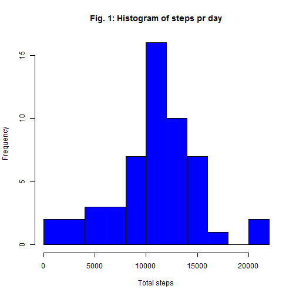
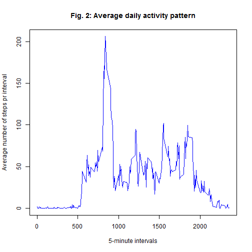
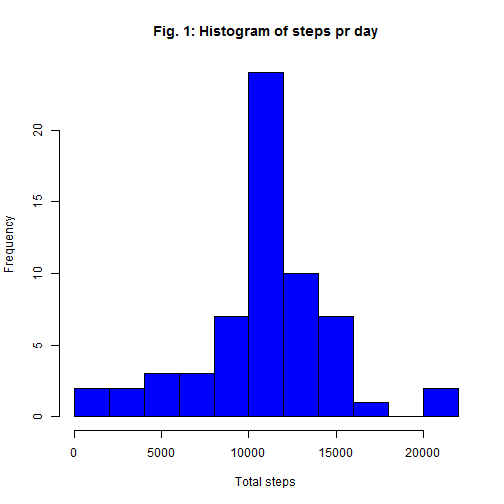

## Loading and preprocessing the data

I'll be using dplyr(), so the last step in preprocessing is loading the data in a data frame using tbl_df()

```r
library(dplyr)
url <- "https://d396qusza40orc.cloudfront.net/repdata%2Fdata%2Factivity.zip"
download.file(url, dest="activity.zip", mode ="wb")
unzip ("activity.zip", exdir = ".")
raw_file <- "activity.csv"
raw_tbl <- read.csv(raw_file)
raw_data <- tbl_df(raw_tbl)
```


## What is mean total number of steps taken per day?


```r
steps_pr_day <- raw_data %>%
     na.omit() %>%
     group_by(date) %>%
     summarize(sum(steps))

colnames(steps_pr_day) <- c("date", "steps")
mean(steps_pr_day$steps)
```

```
## [1] 10766.19
```

```r
median(steps_pr_day$steps)
```

```
## [1] 10765
```

```r
hist(steps_pr_day$steps, breaks=10, col="blue", main="Fig. 1: Histogram of steps pr day", xlab="Total steps")
```



## What is the average daily activity pattern?

```r
steps_pr_interval <- raw_data %>%
     group_by(interval) %>%
     summarize(avgsteps=mean(steps, na.rm=TRUE))

with(steps_pr_interval, plot(interval, avgsteps, type="l", col="blue", main="Fig. 2: Average daily activity pattern", xlab="5-minute intervals", ylab="Average number of steps pr interval"))
```



#Calculating which 5-minute interval with the maximum number of average steps:

```r
maximum_int <- which.max(steps_pr_interval$avgsteps)
steps_pr_interval[maximum_int, ]
```

```
## Source: local data frame [1 x 2]
## 
##   interval avgsteps
##      (int)    (dbl)
## 1      835 206.1698
```

## Imputing missing values
The dataset contains a lot of missing values. I guess sometimes people forgot to wear their fitbit. First we figure out how many rows contains NA


```r
sum(is.na(raw_data$steps))
```

```
## [1] 2304
```

If a value is missing the best raw approximation is to replace it with the average (rounded) value for that interval. This could be expanded to include day of week, but that is not done here.


```r
approx_data <- raw_data %>%
  group_by(interval) %>%
  mutate(steps = ifelse(is.na(steps), round(mean(steps, na.rm=TRUE)), steps))
```

The new dataset is called approx_data. The calculation for mean and median values for average daily steps, and the histogram is repeated for the new dataset.


```r
steps_pr_day_approx <- approx_data %>%
     group_by(date) %>%
     summarize(sum(steps))

colnames(steps_pr_day_approx) <- c("date", "steps")
mean(steps_pr_day_approx$steps)
```

```
## [1] 10765.64
```

```r
median(steps_pr_day_approx$steps)
```

```
## [1] 10762
```

```r
hist(steps_pr_day_approx$steps, breaks=10, col="blue", main="Fig. 1: Histogram of steps pr day", xlab="Total steps")
```



The mean and median have shifted slightly. This is to be expected. The histogram has a much more dominant center around the average number of steps per day. This is to be expected, because a lot of the NA's in the dataset were for whole or large part of a day. Those days are essentially replaced with an average day, giving a lot more observations in the 10000-12000 steps range.


## Are there differences in activity patterns between weekdays and weekends?

